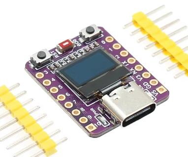
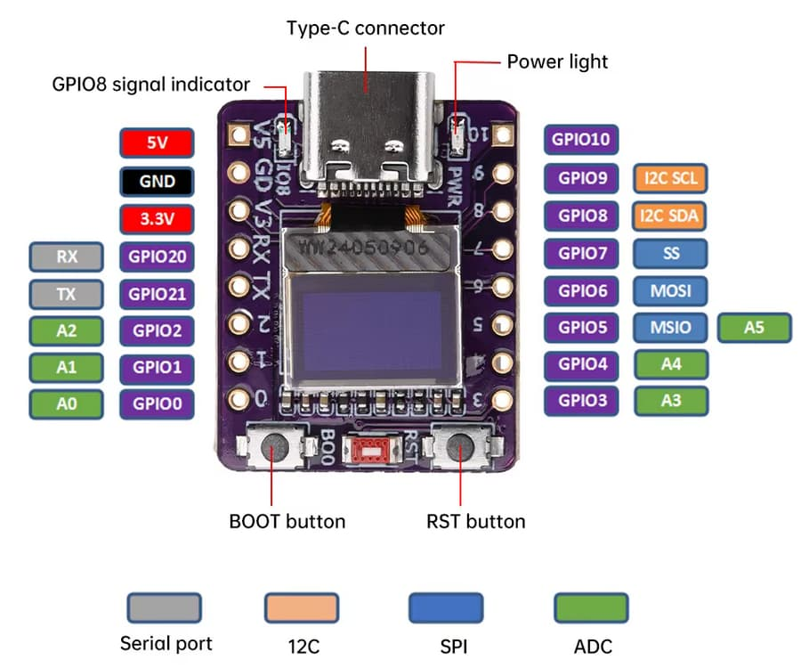

# Smart IoT Oil & Gas Monitoring Node (ESP32-C3)

This repository contains a refinery-grade IoT edge node Proof of Concept (POC) designed for the Oil & Gas industry. 
It features geofenced thermal monitoring for critical refinery stations, a cinematic onboarding tutorial, and a robust fail-safe mechanism.

## 📸 Production Gallery

| Hardware Overview | Pinout & Interface |
| :---: | :---: |
|  |  |

| Live Monitoring State | Demo mode (no WiFi) State |
| :---: | :---: |
|  |  |

---

## 🛠 Project Overview
This IIoT (Industrial Internet of Things) edge node is engineered for high-precision ambient thermal monitoring at critical refinery coordinates, such as those within the Ruwais Industrial City. The system serves as a specialized implementation of Tier 2 Redundancy, designed to ensure continuous operational visibility in harsh or remote environments.

Resilient Architecture & Failover
The node maintains a persistent link to cloud-synchronized meteorological data via the Open-Meteo API. In the event of a network disruption where the local WiFi becomes unavailable the system executes an automated failover protocol. It instantly pivots from live API polling to pre-defined industrial baselines, ensuring that thermal monitoring remains active even in completely offline states.

***Engineering Note: While this POC utilizes API data for geofenced environmental awareness, production deployments are designed to prioritize real-time telemetry from local temperature sensors (e.g., DS18B20 or PT100) connected directly to the device's GPIO.***

### Key Features
* **Geofenced Data Acquisition:** Hardcoded coordinates for **Oil Refinery Stations 405, 406, and 407**.
* **Automatic Failover:** Real-time transition between **LIVE DATA** (API-driven) and **DEMO MODE** (Fallback-driven).
* **Industrial Safety Alerts:** Critical threshold set at **90°C** triggers a high-intensity **RED strobe** via GPIO 8.
* **Cinematic Onboarding:** A pixel-buffer rolling boot manual explaining system operations.

## 🏗 Hardware Details
* **MCU:** ESP32-C3 (RISC-V Architecture).
* **Display:** 0.42" SSD1306 OLED (72x40 visible window).
* **Indicator:** Onboard WS2812B RGB LED.
* **Buttons:**
    * **LEFT Button (BOOT/GPIO 9):** Skip tutorial / Cycle refinery stations.
    * **RIGHT Button (RST):** Hard hardware reboot.

## 🚀 Getting Started
1. **Clone the Repo:** `git clone https://github.com/assix/oil-gas-refinery-smart-iot-monitoring-esp32c3oled.git`
2. **Open in Arduino IDE:** Open the `SmartRefineryThermaMonitor.ino` file.
3. **Install Dependencies:** `U8g2lib`, `ArduinoJson`, `Adafruit_NeoPixel`.
4. **Flash:** Target your ESP32-C3 Dev Module.
